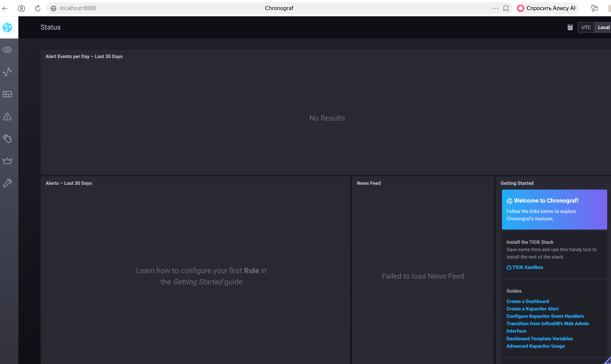
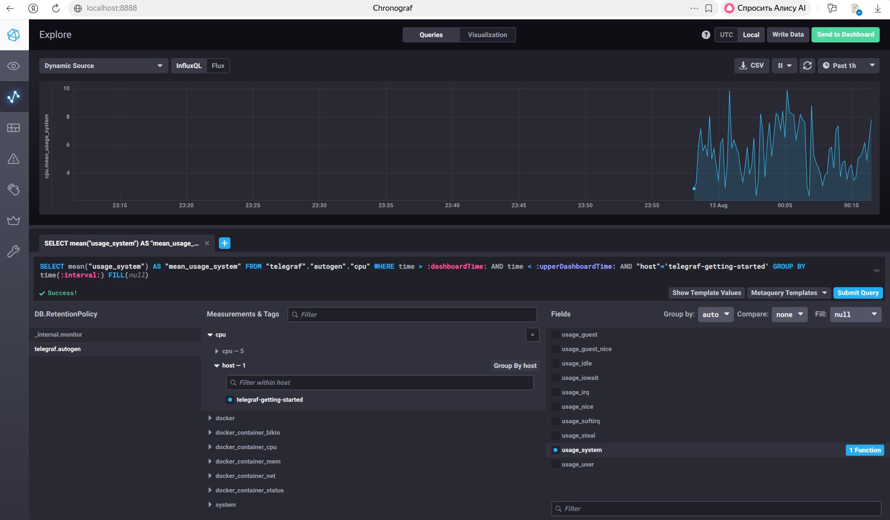
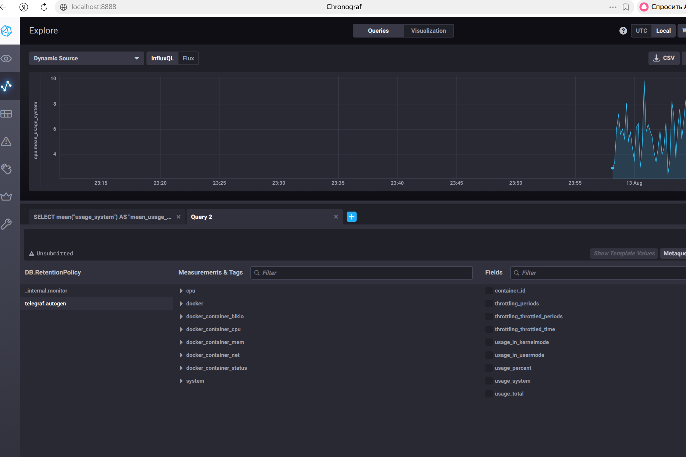
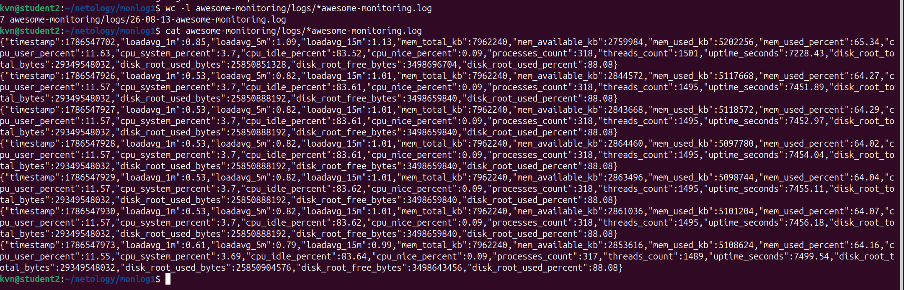
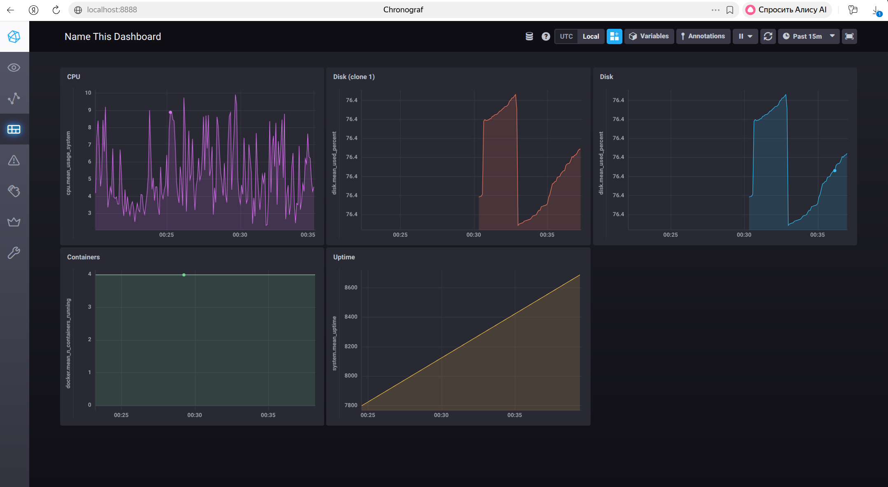

# Домашнее задание: системы мониторинга

Материалы:
- практика — `sandbox/`
- скриншоты — `screenshots/`
- задание со звёздочкой — `awesome-monitoring/`

---

## 1

### Вопрос

Вас пригласили настроить мониторинг на проект. На онбординге вам рассказали, что проект представляет из себя платформу для вычислений с выдачей текстовых отчетов, которые сохраняются на диск. Взаимодействие с платформой осуществляется по протоколу http. Также вам отметили, что вычисления загружают ЦПУ. Какой минимальный набор метрик вы выведите в мониторинг и почему?

### Ответ

Минимальный набор:

1. HTTP — число запросов, коды ответов, время обработки. Нужно, чтобы понимать, доступен ли сервис для клиента.
2. Процессор — доля занятого времени и средняя загрузка. Вычисления создают нагрузку на процессор.
3. Оперативная память — занятый и свободный объём. При нехватке память работа замедляется или процессы завершаются аварийно.
4. Диск — свободное место и свободные файловые узлы на разделе с отчётами. Без места или узлов отчёт не сохранить.
5. Ошибки приложения — число заданий, завершённых с ошибкой. Нужно отличать недоступность сервиса от сбоев при работающем HTTP.
6. Очередь и длительность заданий, если очередь есть. Показывает, успевает ли система выдавать отчёты вовремя.

Остальные метрики можно добавить позже.

---

## 2

### Вопрос

Менеджер продукта посмотрев на ваши метрики сказал, что ему непонятно что такое RAM/inodes/CPUla. Также он сказал, что хочет понимать, насколько мы выполняем свои обязанности перед клиентами и какое качество обслуживания. Что вы можете ему предложить?

### Ответ

Память, файловые узлы и средняя загрузка процессора менеджеру не помогают. Ему нужны показатели по клиентам:

- доля успешных запросов;
- время подготовки отчёта (среднее и значение для 95% запросов);
- выполняется ли целевая доступность, например 99%.

Можно зафиксировать, что измеряем, какие пороги считаем нормой, и при договоре с клиентом отразить это в соглашении об уровне сервиса. Менеджеру — отдельный экран с понятными графиками. Системные метрики оставить инженерам.

---

## 3

### Вопрос

Вашей DevOps команде в этом году не выделили финансирование на построение системы сбора логов. Разработчики в свою очередь хотят видеть все ошибки, которые выдают их приложения. Какое решение вы можете предпринять в этой ситуации, чтобы разработчики получали ошибки приложения?

### Ответ

Без бюджета на полноценную систему сбора логов можно сделать так:

1. Писать ошибки в стандартный поток ошибок контейнера и смотреть их через `docker logs` или журнал системы управления контейнерами.
2. Считать число ошибок и ответов 5xx и отправлять уведомление, когда показатель превышает порог.
3. Собирать только сообщения ERROR и FATAL через journald, rsyslog или небольшое хранилище логов.
4. Подключить сервис регистрации ошибок (например Sentry): разработчик видит место ошибки в коде.
5. По cron разбирать локальные файлы логов, находить строки с `ERROR` и отправлять их в канал команды.

Разработчикам важны сами ошибки вовремя, а не полный архив всех журналов.

---

## 4

### Вопрос

Вы, как опытный SRE, сделали мониторинг, куда вывели отображения выполнения SLA=99% по http кодам ответов. Вычисляете этот параметр по следующей формуле: summ_2xx_requests/summ_all_requests. Данный параметр не поднимается выше 70%, но при этом в вашей системе нет кодов ответа 5xx и 4xx. Где у вас ошибка?

### Ответ

Ошибка в формуле. В числителе только ответы 2xx, в знаменателе — все запросы.

Если 4xx и 5xx нет, а получается около 70%, значит остальное — в основном ответы 3xx (перенаправления, в том числе 304). Для HTTP это обычная ситуация, но формула считает их неуспехом и занижает доступность.

Правильнее считать недоступностью ответы 5xx либо заранее определить, какие коды считаются успехом, и не включать в расчёт служебные проверки работоспособности.

---

## 5

### Вопрос

Опишите основные плюсы и минусы pull и push систем мониторинга.

### Ответ

**Pull** — система мониторинга сама запрашивает метрики у объектов.

Плюсы:
- список объектов и частота опроса задаются в одном месте;
- если объект не ответил, это сразу видно.

Минусы:
- нужен сетевой доступ от системы мониторинга до каждого объекта;
- сложно наблюдать объекты в закрытых сетях и с коротким временем жизни;
- данные обновляются только в момент опроса.

**Push** — программа на объекте сама отправляет метрики в приёмник.

Плюсы:
- можно работать без прямого доступа монитора к объекту;
- данные можно отправлять сразу после сбора.

Минусы:
- приёмник нужно защищать и рассчитывать по нагрузке;
- если данные не приходят, неясно: нет нагрузки или сборщик не работает;
- при обрыве сети данные могут потеряться или прийти с задержкой.

---

## 6

### Вопрос

Какие из ниже перечисленных систем относятся к push модели, а какие к pull? А может есть гибридные?

- Prometheus
- TICK
- Zabbix
- VictoriaMetrics
- Nagios

### Ответ

| Система | Модель | Пояснение |
|---|---|---|
| Prometheus | в основном pull | сама запрашивает `/metrics`; отправка извне — через Pushgateway |
| TICK | в основном push | Telegraf собирает метрики и пишет их в InfluxDB |
| Zabbix | смешанная | сервер может опрашивать узел; программа на узле может сама присылать данные |
| VictoriaMetrics | смешанная | принимает входящие метрики и может сама опрашивать объекты |
| Nagios | в основном pull | сервер запускает проверки; результаты можно также передавать извне |

---

## 7

### Вопрос

Склонируйте себе [репозиторий](https://github.com/influxdata/sandbox/tree/master) и запустите TICK-стэк, используя технологии docker и docker-compose.

В виде решения на это упражнение приведите скриншот веб-интерфейса ПО chronograf (`http://localhost:8888`).

P.S.: если при запуске некоторые контейнеры будут падать с ошибкой — проставьте им режим `Z`, например `./data:/var/lib:Z`.

### Ответ

Стек развёрнут из [influxdata/sandbox](https://github.com/influxdata/sandbox):

```bash
cd sandbox
source .env-latest
docker compose up -d --build
```

Chronograf: http://localhost:8888

В `docker-compose.yml` для каталогов указан суффикс `:Z`. У сервиса `telegraf` заданы повышенные права (`privileged`), подключение `/var/run/docker.sock` и порты из задания.



---

## 8

### Вопрос

Перейдите в веб-интерфейс Chronograf (http://localhost:8888) и откройте вкладку Data explorer.

- Нажмите на кнопку Add a query
- Изучите вывод интерфейса и выберите БД telegraf.autogen
- В `measurments` выберите cpu→host→telegraf-getting-started, а в `fields` выберите usage_system. Внизу появится график утилизации cpu.
- Вверху вы можете увидеть запрос, аналогичный SQL-синтаксису. Поэкспериментируйте с запросом, попробуйте изменить группировку и интервал наблюдений.

Для выполнения задания приведите скриншот с отображением метрик утилизации cpu из веб-интерфейса.

### Ответ

В Explore выбраны: база `telegraf.autogen`, набор метрик `cpu`, узел `telegraf-getting-started`, поле `usage_system`.

```sql
SELECT mean("usage_system") AS "mean_usage_system"
FROM "telegraf"."autogen"."cpu"
WHERE time > now() - 15m
  AND "host" = 'telegraf-getting-started'
  AND "cpu" = 'cpu-total'
GROUP BY time(10s) FILL(null)
```



---

## 9

### Вопрос

Изучите список [telegraf inputs](https://github.com/influxdata/telegraf/tree/master/plugins/inputs). Добавьте в конфигурацию telegraf следующий плагин — [docker](https://github.com/influxdata/telegraf/tree/master/plugins/inputs/docker):

```
[[inputs.docker]]
  endpoint = "unix:///var/run/docker.sock"
```

Дополнительно вам может потребоваться донастройка контейнера telegraf в `docker-compose.yml` дополнительного volume и режима privileged:

```
  telegraf:
    image: telegraf:1.4.0
    privileged: true
    volumes:
      - ./etc/telegraf.conf:/etc/telegraf/telegraf.conf:Z
      - /var/run/docker.sock:/var/run/docker.sock:Z
    links:
      - influxdb
    ports:
      - "8092:8092/udp"
      - "8094:8094"
      - "8125:8125/udp"
```

После настройке перезапустите telegraf, обновите веб интерфейс и приведите скриншотом список `measurments` в веб-интерфейсе базы telegraf.autogen. Там должны появиться метрики, связанные с docker.

### Ответ

В `sandbox/telegraf/telegraf.conf`:

```toml
[[inputs.docker]]
  endpoint = "unix:///var/run/docker.sock"
  timeout = "5s"
```

В `docker-compose.yml` у `telegraf`: `privileged: true`, подключение `/var/run/docker.sock`, порты `8092/udp`, `8094`, `8125/udp`.

После перезапуска в `telegraf.autogen` есть наборы метрик `docker`, `docker_container_cpu`, `docker_container_mem`, `docker_container_status` и связанные с ними.



---

## Дополнительное задание (*)

### Вопрос

Вы устроились на работу в стартап. На данный момент у вас нет возможности развернуть полноценную систему мониторинга, и вы решили самостоятельно написать простой python3-скрипт для сбора основных метрик сервера. Вы, как опытный системный-администратор, знаете, что системная информация сервера лежит в директории `/proc`. Также вы знаете, что в системе Linux есть планировщик задач cron, который может запускать задачи по расписанию.

Суммировав все, вы спроектировали приложение, которое:
- является python3 скриптом;
- собирает метрики из папки `/proc`;
- складывает метрики в файл `YY-MM-DD-awesome-monitoring.log` в директорию `/var/log`;
- каждый сбор метрик складывается в виде json-строки с полями `timestamp` и `metric_1` … `metric_N`;
- сбор метрик происходит каждую 1 минуту по cron-расписанию.

Для успешного выполнения задания нужно привести:

а) работающий код python3-скрипта,  
б) конфигурацию cron-расписания,  
в) пример верно сформированного `YY-MM-DD-awesome-monitoring.log`, имеющий не менее 5 записей.

P.S.: количество собираемых метрик должно быть не менее 4-х.  
P.P.S.: по желанию можно себя не ограничивать только сбором метрик из `/proc`.

### Ответ

#### а) Код

[`awesome-monitoring/awesome_monitoring.py`](awesome-monitoring/awesome_monitoring.py)

Скрипт читает `/proc` (и дополнительно данные о диске), пишет строки JSON в `/var/log/YY-MM-DD-awesome-monitoring.log`. Собираются: средняя загрузка, память, процессор, число процессов и потоков, время непрерывной работы системы, заполнение корневого раздела.

```bash
sudo python3 awesome-monitoring/awesome_monitoring.py
LOG_DIR=./awesome-monitoring/logs python3 awesome-monitoring/awesome_monitoring.py
```

#### б) Cron

[`awesome-monitoring/crontab.example`](awesome-monitoring/crontab.example)

```cron
* * * * * /usr/bin/python3 /полный/путь/к/awesome-monitoring/awesome_monitoring.py >> /var/log/awesome-monitoring-cron.log 2>&1
```

#### в) Пример лога

[`awesome-monitoring/example-26-08-13-awesome-monitoring.log`](awesome-monitoring/example-26-08-13-awesome-monitoring.log) — не менее 5 записей.



---

### Вопрос

В веб-интерфейсе откройте вкладку `Dashboards`. Попробуйте создать свой dashboard с отображением:

- утилизации ЦПУ
- количества использованного RAM
- утилизации пространства на дисках
- количество поднятых контейнеров
- аптайм
- и другие показатели по желанию

### Ответ

Создан dashboard `Sandbox overview` в Chronograf с панелями: CPU (`usage_system`), RAM (`mem.used_percent`), диск (`disk.used_percent`), число контейнеров (`docker.n_containers_running`), аптайм (`system.uptime`).

Для RAM и диска в `telegraf.conf` добавлены плагины `[[inputs.mem]]` и `[[inputs.disk]]`.


